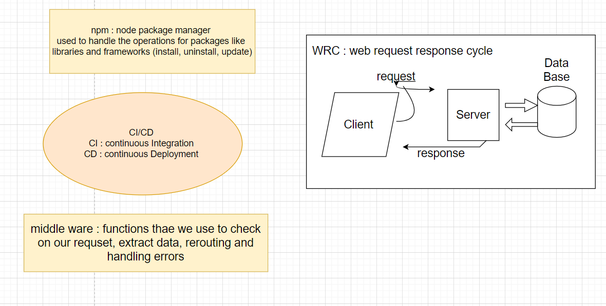

# server-deployment-practice

# LAB - 01
 # Deployment Test
## Author: Dima Alabsi

* submission PR

## Setup
 .env requirements
* PORT - 8080
## Running the app
* npm run dev

* Endpoint:  **/status** 

    * Returns Object

{

  ***"domain1": "dimaalabsi-server-deploy-dev.herokuapp.com",***

  ***"domain2": "dimaalabsi-server-deploy-prod.herokuapp.com",***

  ***"status": "running",***

  ***"port": 42123***

}

## Tests

* Unit Tests: npm run test

## Heroku applications 

* dimaalabsi-server-deploy-dev.herokuapp.com
* dimaalabsi-server-deploy-prod.herokuapp.com

## Github actions

* github.com/DimaAlabsi/server-deployment-practice/actions
 [actions](https://github.com/DimaAlabsi/server-deployment-practice/actions)  

## pull request

* github.com/DimaAlabsi/server-deployment-practice/pull/4

## UML

